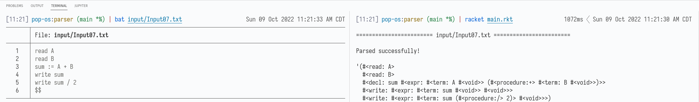
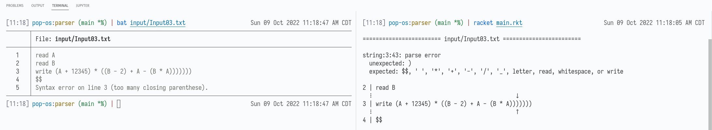
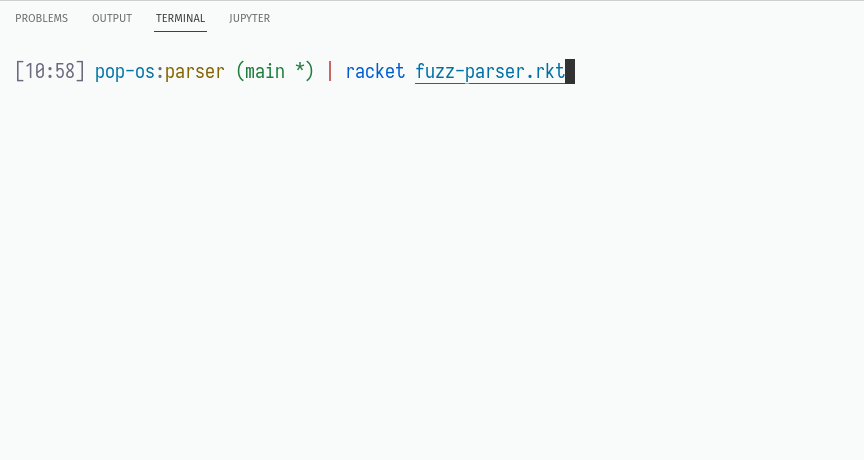

# Overview

This is a project for my undergrad Programming Languages class, not intended to be taken as an example of how to write a parser (or even idiomatic Racket). I used [Megaparsack](https://docs.racket-lang.org/megaparsack/) to implement the parsing logic due to the conciseness, flexibility, and reliability of parser combinators.

> **NOTE**
> 
> My submission for this project is exclusively what lives in the parent folder:
> - **main.rkt** (driver)
> - **parser.rkt** (the business logic)
> - **utility.rkt** (contains custom types for each individual token + display logic)
> - **test-parser.rkt** (tests against a small set of test cases with known scenarios) 
> - **fuzz-parser.rkt** (tests against a large set of random but syntactically correct files in `input/tests/`)
> 
> I kept a series of sketches and ideas in the `sketches` folder because there were a ton of interesting ways to make this project happen and let's be honest, I worked too hard on some of those to just drop them completely. Some of them work, some of them don't, they're just saved for my own sake.

# Resources

- I've used parser combinator libraries in other languages, but the [Megaparsack tutorial](https://docs.racket-lang.org/megaparsack/) was a major source of syntax/design choices. Much of my parser logic follows directly from the tutorial, so there may be sections of very similar code.
- This didn't make the final cut, but I used Bartosz Milewski's [Basics of Haskell tutorial](https://www.schoolofhaskell.com/user/bartosz/basics-of-haskell/7-tokenizer-higher-order-functions) to better understand a co-recursive approach to tokenization. This can be found under `sketches/corecursion/tokenizer.rkt`. I directly translated his `span` function to Racket.
- I used [PLAI Scheme](https://docs.racket-lang.org/plai/plai-scheme.html) and its sister language [Plait](https://docs.racket-lang.org/plait/index.html) to prototype type definitions for various stages of the sketches, so some code snippets from the relevant documentation may appear in sketches. The final parser is plain Racket (and unchecked [Typed Racket](https://docs.racket-lang.org/ts-reference/index.html)).
- The fuzz files in `input/tests/` were graciously provided by another student, I'll name them in my submission comment for privacy.

# Examples

## Success

## Failure

## Fuzzing (with error)

